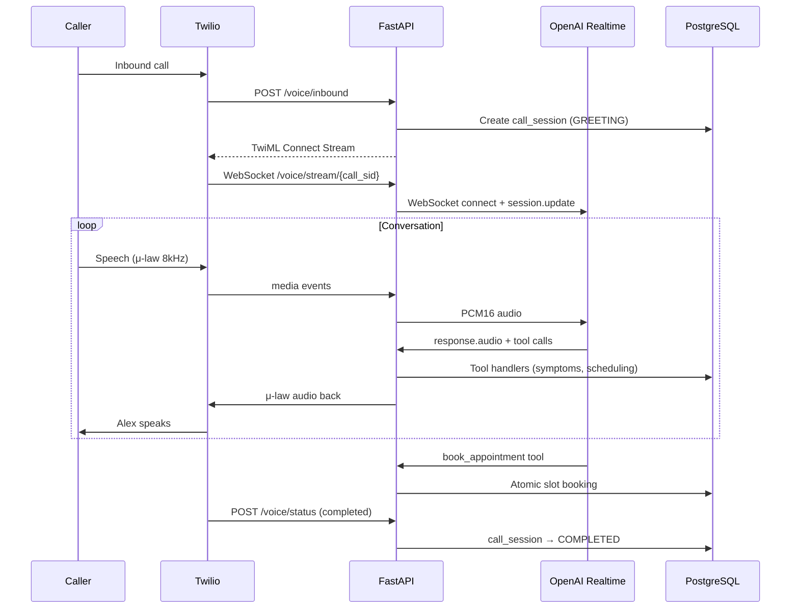
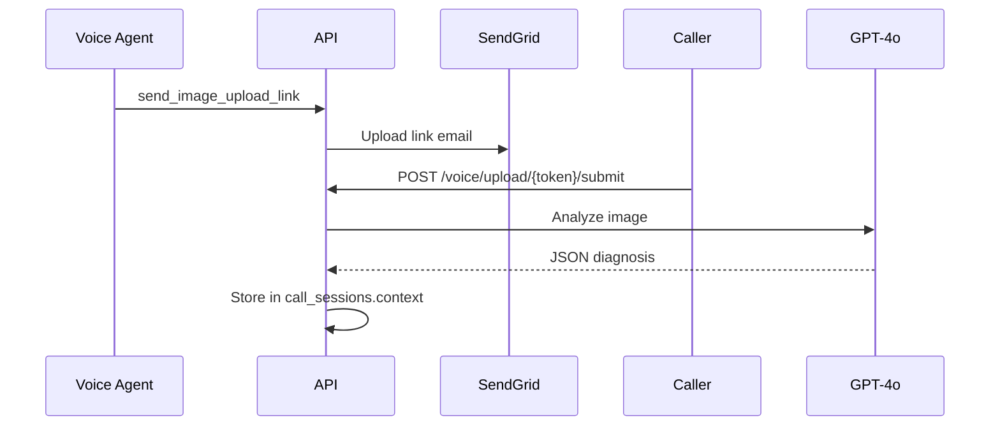

# Architecture — Inbound Call Happy Path

```mermaid
sequenceDiagram
    participant Caller
    participant Twilio
    participant API as FastAPI
    participant OAI as OpenAI Realtime
    participant DB as PostgreSQL

    Caller->>Twilio: Inbound call
    Twilio->>API: POST /voice/inbound
    API->>DB: Create call_session (GREETING)
    API-->>Twilio: TwiML Connect Stream
    Twilio->>API: WebSocket /voice/stream/{call_sid}
    API->>OAI: WebSocket connect + session.update
    loop Conversation
        Caller->>Twilio: Speech (μ-law 8kHz)
        Twilio->>API: media events
        API->>OAI: PCM16 audio
        OAI->>API: response.audio + tool calls
        API->>DB: Tool handlers (symptoms, scheduling)
        API->>Twilio: μ-law audio back
        Twilio->>Caller: Alex speaks
    end
    OAI->>API: book_appointment tool
    API->>DB: Atomic slot booking
    Twilio->>API: POST /voice/status (completed)
    API->>DB: call_session → COMPLETED
```

## Tier 3 — Visual diagnosis

```mermaid
sequenceDiagram
    participant Alex as Voice Agent
    participant API
    participant Email as SendGrid
    participant Caller
    participant Vision as GPT-4o

    Alex->>API: send_image_upload_link
    API->>Email: Upload link email
    Caller->>API: POST /voice/upload/{token}/submit
    API->>Vision: Analyze image
    Vision-->>API: JSON diagnosis
    API->>API: Store in call_sessions.context
```
